# Claude Code Context 窗口机制说明

这份文档解释一个常见现象：在 Claude Code 里，context 大小并不是随对话线性增长，而是会涨、会跌。这里的下降不一定表示触发了传统意义上的 `/compact` 或 autocompact；很多时候，它只是 Claude Code 在每次请求前重新构造了“模型实际可见的上下文窗口”。

## 一句话结论

Claude Code 统计和发送的不是原始 transcript 的累计 token，而是“下一次 API 请求实际会看到的窗口”。每轮请求前，原始消息会经过 boundary 裁剪、tool result budget 替换、history snip、microcompact、context collapse 投影等步骤；这些步骤都可能让可见 context 下降。

## 术语与概念

| 术语 | 含义 | 在本文里的作用 |
| --- | --- | --- |
| context / context window | 模型一次请求里可看到的输入窗口，通常按 token 计。它不是本地 transcript 文件大小，也不是历史累计消耗。 | 解释为什么数字可以下降 |
| transcript | Claude Code 本地记录的完整会话历史，包含用户消息、assistant 消息、工具调用、工具结果、系统事件等。 | 本地层保存得更完整，但 API 不一定全看见 |
| raw history | 未经过请求前变换的原始消息数组，也就是 REPL 当前持有的 `messages`。 | `/context` 刻意不直接统计它 |
| API view | 经过裁剪、替换、snip、microcompact、collapse 投影后的请求视图。 | 模型实际看到的是这一层 |
| messagesForQuery | `query.ts` 中用于发起模型请求的消息数组。 | 本文分析的主线变量 |
| compact boundary | compact 后插入的边界消息。之后请求通常只取最后一个 boundary 之后的消息。 | 传统 compact 的可见标记 |
| autocompact | 达到阈值后自动生成 summary，并用 compact 后消息继续请求。 | 只是 context 下降的一种原因 |
| microcompact | 更轻量的上下文瘦身机制，重点清理旧 tool result；可能不生成传统 summary。 | 常见的“没 compact 但下降”原因 |
| cached microcompact | 使用服务端 cache editing 删除旧 tool result，本地 messages 不改。 | 最隐蔽的下降来源之一 |
| time-based microcompact | 空闲超过阈值后，认为 prompt cache 已冷，直接把旧 tool result 内容替换为短占位。 | 放置一段时间后 context 下降的常见原因 |
| history snip | 在请求前移除或投影部分旧历史，并记录节省的 token。 | 比 autocompact 更早发生 |
| context collapse | 将部分历史归档到 collapse store，读请求时投影成更小视图。 | 不等同于传统 compact |
| tool result | 工具调用返回的内容，例如文件读取、shell 输出、搜索结果。 | context 膨胀的主要来源 |
| budget | context/token 的可用额度，不是财务预算。 | 控制某类内容最多占多少上下文空间 |
| token usage / API usage | 模型 API 返回的 usage 字段，例如 `input_tokens`、`cache_read_input_tokens`。 | status line 和 `/context` 总量优先使用 |
| rough estimate | 本地粗略 token 估算，用于还没有 API usage 的新增消息。 | 会导致数字先涨再被校准 |
| prompt cache | 服务端对相同 prompt 前缀的缓存。cache 命中时，usage 会拆成 cache read/create。 | 影响显示口径和 cached microcompact |

可以把这些概念压成一张图：

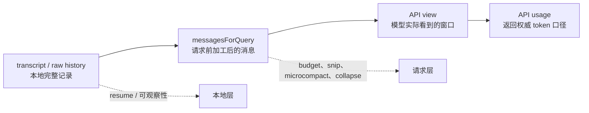


对应主链路在 `src/query.ts`：

| 阶段 | 作用 | 主要源码 |
| --- | --- | --- |
| compact boundary 裁剪 | 只保留最后一次 compact boundary 之后的消息 | `getMessagesAfterCompactBoundary(messages)` |
| tool result budget | 过大的工具输出被替换成短占位内容 | `applyToolResultBudget(...)` |
| history snip | 移除或投影部分旧历史，并把节省 token 传给后续判断 | `snipCompactIfNeeded(...)` |
| microcompact | 清理或 cache-edit 旧工具结果 | `microcompactMessages(...)` |
| context collapse | 用投影视图替代部分历史，summary 存在 collapse store 中 | `contextCollapse.applyCollapsesIfNeeded(...)` |
| autocompact | 达阈值后生成传统 compact summary | `deps.autocompact(...)` |

## `/context` 看到的不是 raw history

`/context` 命令会刻意模拟 API 前的上下文变换，而不是直接统计 REPL 原始历史。

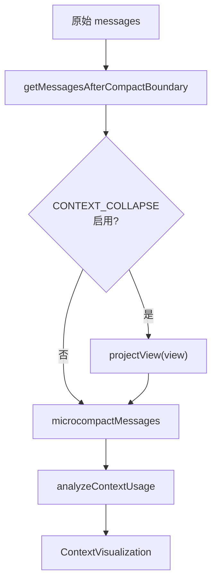

源码位置：

- `src/commands/context/context.tsx`
- `src/utils/analyzeContext.ts`
- `src/components/ContextVisualization.tsx`

`context.tsx` 里的注释已经点明设计目标：`/context` 要显示模型实际看到的内容，而不是 REPL raw history。否则用户可能看到 180k，但 API 实际只看见 120k。

## 为什么会下降

### 1. Tool result budget 替换

很多 context 膨胀来自工具输出，例如 `Read`、`Bash`、`Grep`、`WebFetch` 的结果。Claude Code 会对工具结果做 budget 控制，超过 budget 的旧结果会被替换成较短内容。


源码入口：

- `src/query.ts` 中调用 `applyToolResultBudget(...)`
- `src/utils/toolResultStorage.ts` 中实现 budget 和替换记录

效果：对话历史还在，但下一次请求不再携带完整旧工具输出，所以 context 会降低。

### 2. History snip

`HISTORY_SNIP` 开启时，Claude Code 会在 microcompact 前先做 snip。它可能移除部分旧消息，同时把 `tokensFreed` 传给 autocompact 判断，避免因为旧 usage 仍然偏高而误判。

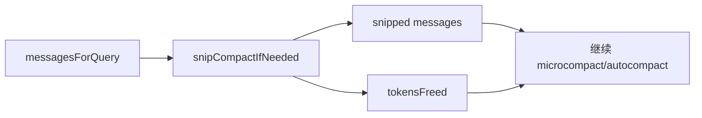

源码入口：

- `src/query.ts` 的 `snipModule!.snipCompactIfNeeded(messagesForQuery)`

效果：这不是传统 summary compact，但会让实际窗口变小。

### 3. Time-based microcompact

当距离上次 assistant 消息超过阈值时，服务端 prompt cache 很可能已经冷了。此时 Claude Code 会把旧的 compactable tool result 内容清成：

```text
[Old tool result content cleared]
```

只保留最近 N 个工具结果。

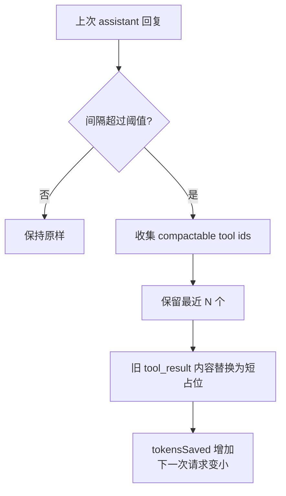

源码入口：

- `src/services/compact/microCompact.ts`
- `evaluateTimeBasedTrigger(...)`
- `maybeTimeBasedMicrocompact(...)`

效果：没有 compact boundary，也没有 summary，但旧工具结果被内容清空，因此 context 会下降。

### 4. Cached microcompact

cached microcompact 更隐蔽。它不会修改本地 messages，而是使用 cache editing API，在 API 层插入 `cache_reference` / `cache_edits`，删除旧 tool result。

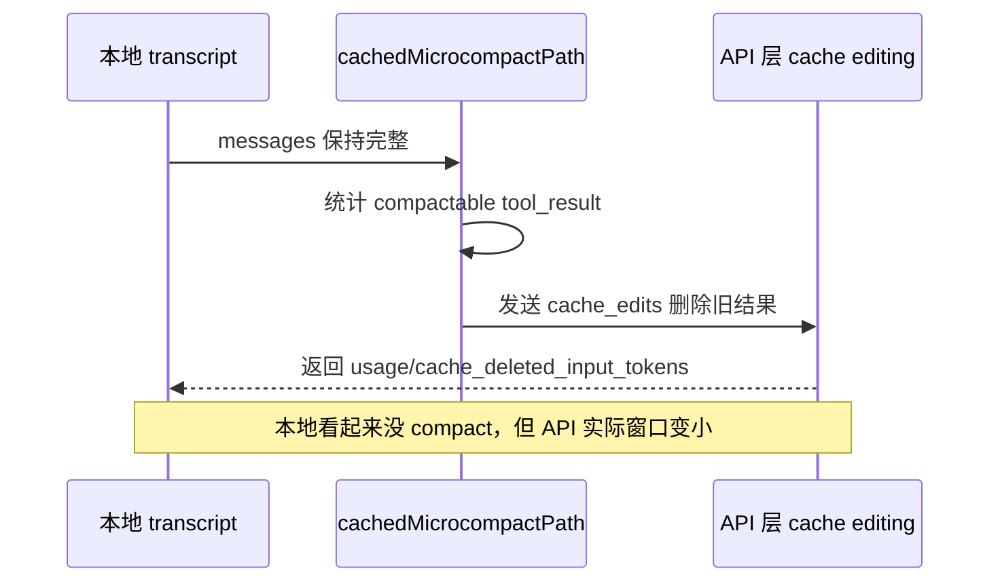

源码入口：

- `src/services/compact/microCompact.ts`
- `cachedMicrocompactPath(...)`
- `consumePendingCacheEdits()` / `pinCacheEdits(...)`

关键注释：cached microcompact 不修改本地消息，cache reference 和 cache edits 会在 API 层加入。因此它尤其容易造成“我没看到压缩，但 context 下降了”的体感。

### 5. Context collapse 投影

context collapse 不是传统 autocompact。它把一段历史归档到 collapse store，再在读的时候通过 `projectView()` 投影出模型应该看到的视图。

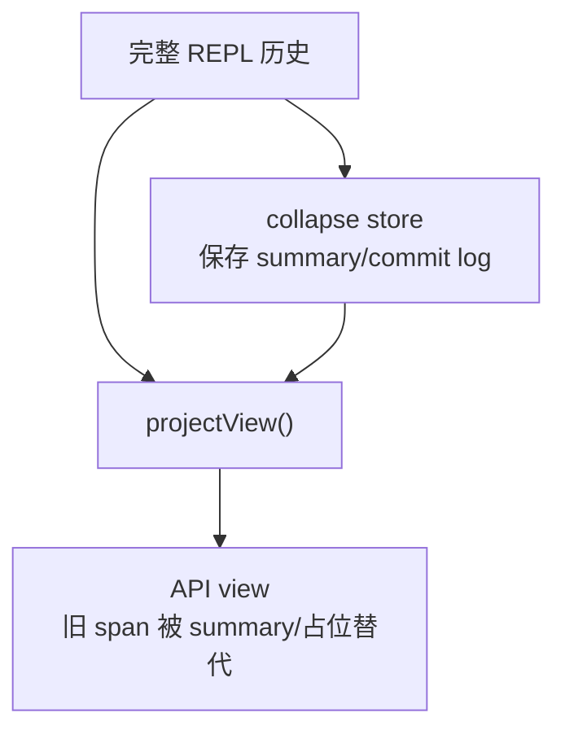

源码入口：

- `src/query.ts` 中的 `contextCollapse.applyCollapsesIfNeeded(...)`
- `/context` 中的 `projectView(view)`
- `src/services/contextCollapse/*`，在 feature gate 下按需加载

效果：原始历史不一定从 REPL 数组消失，但 API 视图已经更小。

## 统计数字为什么也会跳

Claude Code 有两类 token 口径：

| 口径 | 用途 | 公式/来源 |
| --- | --- | --- |
| 最近 API usage | status line、`/context` 总量优先使用 | `input_tokens + cache_creation_input_tokens + cache_read_input_tokens` |
| 本地估算 | 阈值判断、新增消息还没经过 API 时 | 最近真实 API usage + 新增消息 rough estimate |

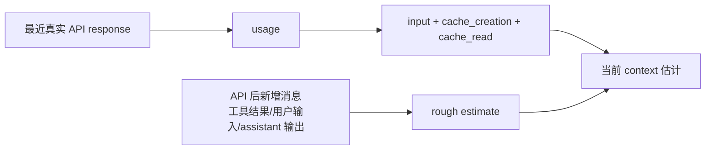

源码入口：

- `src/utils/context.ts` 的 `calculateContextPercentages(...)`
- `src/utils/tokens.ts` 的 `getCurrentUsage(...)`
- `src/utils/tokens.ts` 的 `tokenCountWithEstimation(...)`
- `src/utils/analyzeContext.ts` 的 `totalFromAPI`

因此，工具执行期间本地估算可能先涨；下一次 API 返回真实 usage 后，估算被校准，数字可能回落。

## Autocompact 只是其中一种下降方式

传统 autocompact 仍然存在，但它是更重的一层：达到阈值后生成 summary，并产出 compact 后消息。

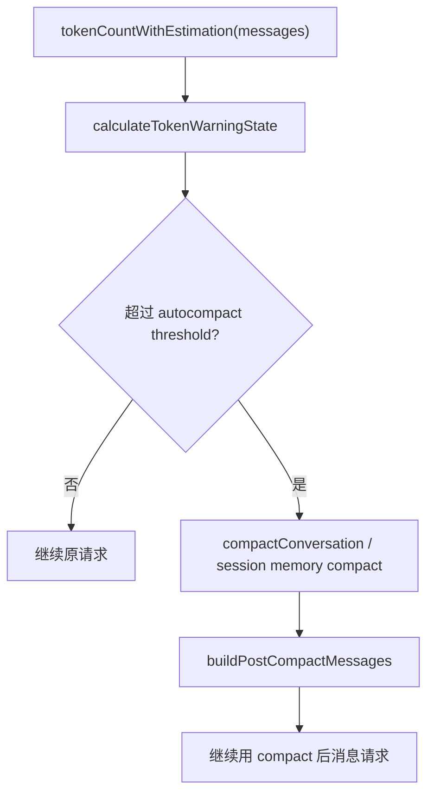

阈值相关源码：

- `src/services/compact/autoCompact.ts`
- `getEffectiveContextWindowSize(model)`
- `getAutoCompactThreshold(model)`
- `calculateTokenWarningState(...)`
- `shouldAutoCompact(...)`

默认逻辑会预留 summary 输出空间，并额外留 autocompact buffer。也就是说，UI 里的剩余空间和触发阈值并不是直接等于模型物理最大上下文。

## 典型现象对照表

| 现象 | 更可能的原因 | 是否传统 compact |
| --- | --- | --- |
| context 缓慢上涨 | 新消息、工具调用、工具结果进入窗口 | 否 |
| 一次工具调用后上涨很多 | tool result 很大，尤其是读取/搜索/命令输出 | 否 |
| 下一轮突然下降，但没有 compact boundary | tool result budget、microcompact、cached microcompact、context collapse 投影 | 否 |
| 放置一段时间后再问，context 下降 | time-based microcompact 清理旧 tool result | 否 |
| `/context` 比 raw transcript 看起来小 | `/context` 模拟 API view，不看 raw history | 否 |
| 出现 compact boundary 或 summary | 手动 `/compact` 或 autocompact | 是 |
| status line 数字跳动 | API usage 和本地 rough estimate 切换/校准 | 否 |

## 示例

下面的数字是简化示例，用来说明机制，不代表固定阈值或精确 token 计算。

### 示例 1：大工具输出先涨，随后被 budget 替换

用户让 Claude Code 读取一个很大的日志文件：

```text
第 1 轮：当前 context 约 42k
第 2 轮：Read 返回大量日志，context 升到 118k
第 3 轮：旧 Read 结果被 tool result budget 替换，context 回落到 63k
```

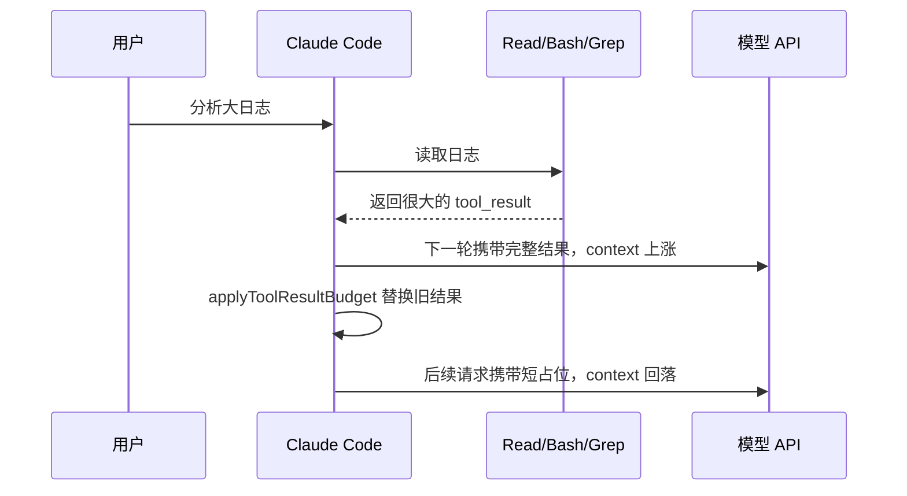

这类下降通常没有 compact boundary，因为它不是 summary compact，只是旧工具结果不再完整进入 API view。

### 示例 2：空闲一段时间后突然下降

用户上午做了很多文件读取，中午暂停，下午继续问：

```text
上午最后一轮：context 约 156k
下午继续提问：context 约 91k
```

可能原因是 time-based microcompact。空闲超过阈值后，Claude Code 认为服务端 prompt cache 已经冷了，继续保留完整旧工具输出也不能复用缓存，于是把旧 tool result 清成短占位，只保留最近 N 个。


你看到的是“继续对话时 context 少了”，但不是传统 compact。

### 示例 3：本地 transcript 没变，但 API view 变小

cached microcompact 的表现更像这样：

```text
本地 transcript：仍能看到历史工具结果记录
API view：旧 tool_result 通过 cache_edits 被删除
显示/usage：下一轮 context 下降
```

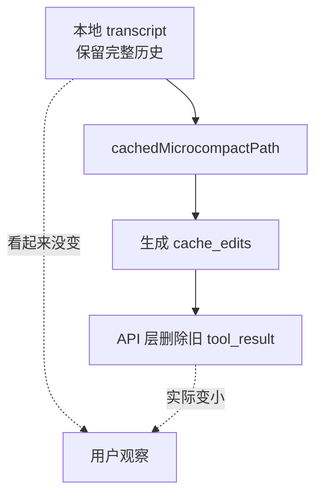

这就是为什么“我没有看到 compact summary，也没有看到历史被改，但 context 确实下降了”是合理现象。

### 示例 4：工具执行期间估算上涨，API 返回后校准下降

当一轮还没完成时，Claude Code 只能对新增消息做 rough estimate。下一次 API 返回 usage 后，显示口径会切回更权威的 API usage。

```text
工具执行中：最近 API usage 70k + 本地估算新增 35k = 105k
下一次 API 返回：input + cache_read + cache_creation = 94k
显示结果：105k 回落到 94k
```

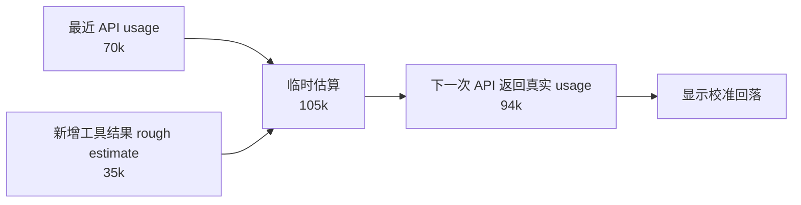

这不是任何 compact，而是计数口径从本地估算变成 API usage。

### 示例 5：真正 autocompact 的样子

真正 autocompact 通常会出现 compact boundary 或 summary 相关消息：

```text
压缩前：context 逼近 autocompact threshold
触发：compactConversation / session memory compact
压缩后：生成 summary，后续请求使用 compact 后消息
```

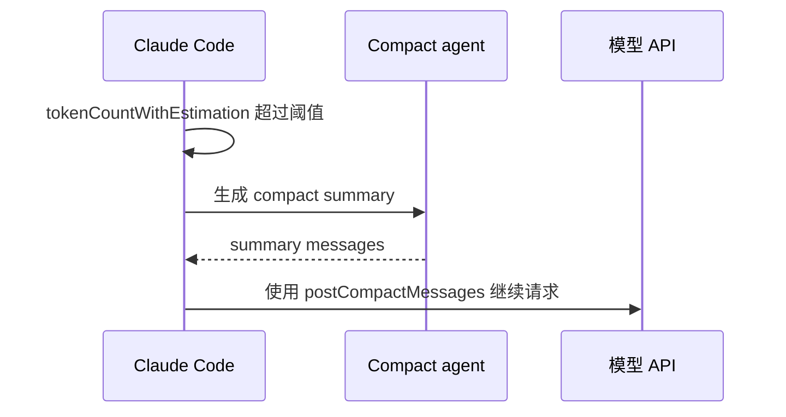

这和前几个示例不同：autocompact 会把多段历史压成 summary，是重型上下文管理。

## 调试路径

如果要确认某次下降来自哪里，可以按下面顺序查：

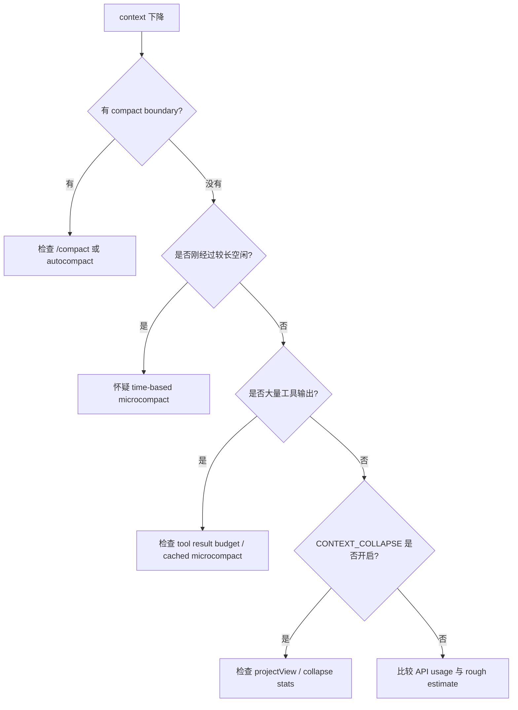

推荐 grep：

```bash
rg -n "applyToolResultBudget|snipCompactIfNeeded|microcompactMessages|applyCollapsesIfNeeded|tokenCountWithEstimation|calculateContextPercentages" src
```

## 心智模型

把 Claude Code 的上下文想成两层：

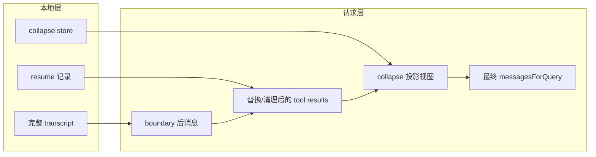

本地层负责保留会话、恢复和可观察性；请求层负责控制模型实际看到的内容。context 大小涨跌主要发生在请求层，所以它不会像 transcript 文件大小那样单调增长。
